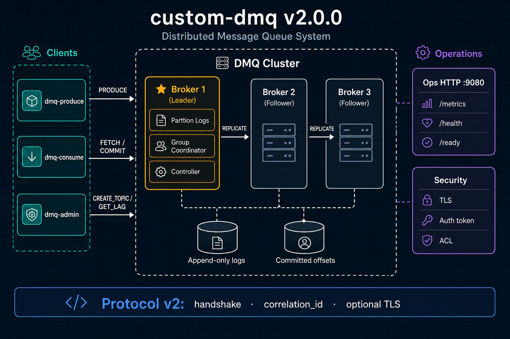

# custom-dmq

**A Kafka-shaped distributed message queue in Rust** — append-only partition logs, pull-based fetch with offset commits, multi-broker replication, and automatic leader failover.

Built as a deliberately scoped systems project: production-minded engineering (workspace crates, CI/CD, Docker, Helm) without pretending to be Apache Kafka.

[](https://github.com/LKPJohn2026/custom-dmq/actions/workflows/ci.yml)
[](https://github.com/LKPJohn2026/custom-dmq/releases)

---

## Architecture



Clients connect **to** the broker cluster. Each topic-partition has one append-only log; consumer groups read at independent offsets. The leader accepts writes, replicates to followers, and the embedded controller handles heartbeats and failover.

| Layer | Responsibility |
|-------|----------------|
| **Clients** | `dmq-produce`, `dmq-consume`, `dmq-admin` — broker-centric TCP, protocol v2 |
| **Broker cluster** | Leader/follower replication, partition logs, group coordinator |
| **Storage** | Durable append-only segments + committed offsets under `DMQ_DATA_DIR` |
| **Operations** | Prometheus metrics, health/readiness probes, optional TLS + ACLs |

Deep dive: [`docs/architecture.md`](docs/architecture.md) · Wire format: [`docs/protocol.md`](docs/protocol.md) · Runbook: [`docs/runbook.md`](docs/runbook.md)

---

## Features

- **Topic-partition logs** — one canonical write path; replay and lag are first-class
- **Pull-based consumption** — `FETCH` + explicit `COMMIT`; no hidden queue pops
- **3-broker HA cluster** — leader replication, ISR acks, automatic leader promotion
- **Consumer groups** — `JOIN_GROUP` / `GROUP_HEARTBEAT`, range assignment, rebalance
- **Protocol v2** — handshake, correlation ids, backward-compatible v1 frames
- **Security** — optional TLS, bearer-token auth, topic-level ACLs
- **Operations** — `/metrics`, `/health`, `/ready`; configurable fsync and idempotent produce
- **Deploy anywhere** — Docker Compose, Kubernetes manifests, Helm chart, GHCR images

---

## Quick start

### Prerequisites

- Rust stable ([`rust-toolchain.toml`](rust-toolchain.toml) pins toolchain + clippy/rustfmt)
- Docker (optional, for cluster demo)

### Single broker (local)

```bash
# Terminal 1 — broker
cargo run -p dmq-cli --bin dmq-broker

# Terminal 2 — produce one message
cargo run -p dmq-cli --bin dmq-produce -- 1 --simulate --once

# Terminal 3 — fetch and commit
cargo run -p dmq-cli --bin dmq-consume -- 1 1 --once
```

The umbrella CLI still works: `cargo run -p dmq-cli --bin custom-dmq -- server`

### 3-broker cluster (Docker)

```bash
docker compose up --build

# Health checks
curl -sf http://127.0.0.1:9080/ready

# Produce / consume against broker-1
cargo build --release -p dmq-cli
DMQ_BROKER_PORT=7777 ./target/release/dmq-produce 1 --simulate --once
DMQ_BROKER_PORT=7777 ./target/release/dmq-consume 1 1 --once
```

One-command demo (includes sample producer + consumer):

```bash
docker compose --profile demo up
```

Container image: `ghcr.io/lkpjohn2026/custom-dmq:v2.0.0`

---

## Binaries

| Binary | Purpose |
|--------|---------|
| `dmq-broker` | Run the broker server |
| `dmq-produce` | Append records to a topic |
| `dmq-consume` | Fetch batches and commit offsets |
| `dmq-admin` | Create/describe topics, inspect lag, cluster metadata |
| `custom-dmq` | Umbrella CLI (`server`, `produce`, `fetch`, `admin`, …) |

Build all binaries:

```bash
cargo build --release -p dmq-cli
```

---

## Workspace layout

```text
custom-dmq/
├── crates/
│   ├── dmq-protocol/     Wire messages + v2 framing
│   ├── dmq-storage/      Partition logs, metadata, idempotency
│   ├── dmq-core/         Topics, groups, cluster config, auth, metrics
│   ├── dmq-broker/       Broker runtime, replication, coordinator
│   └── dmq-cli/          Standalone binaries + CLI runner
├── tests/                Integration tests (cluster, failover, protocol, …)
├── config/               Cluster TOML examples
├── deploy/               K8s manifests, Helm chart, Grafana dashboard
└── docs/                 Architecture, protocol, ADRs, runbook
```

---

## Multi-broker cluster (native)

Use [`config/cluster.example.toml`](config/cluster.example.toml) and start one process per broker:

```bash
DMQ_BROKER_ID=1 DMQ_BROKER_PORT=7777 DMQ_DATA_DIR=dmq-data-1 \
  DMQ_CLUSTER_CONFIG=config/cluster.example.toml \
  cargo run -p dmq-cli --bin dmq-broker

DMQ_BROKER_ID=2 DMQ_BROKER_PORT=7778 DMQ_DATA_DIR=dmq-data-2 \
  DMQ_CLUSTER_CONFIG=config/cluster.example.toml \
  cargo run -p dmq-cli --bin dmq-broker

DMQ_BROKER_ID=3 DMQ_BROKER_PORT=7779 DMQ_DATA_DIR=dmq-data-3 \
  DMQ_CLUSTER_CONFIG=config/cluster.example.toml \
  cargo run -p dmq-cli --bin dmq-broker
```

With `DMQ_CLUSTER_CONFIG` set, clients route to partition leaders automatically. Set `DMQ_ACKS=all` to wait for `min_insync_replicas` followers.

The lowest broker id runs the embedded controller: heartbeats detect failed leaders, ISR followers promote with a new epoch, and clients refresh topology via `GET_CLUSTER`.

---

## Configuration

All runtime config is via environment variables.

### Core

| Variable | Default | Description |
|----------|---------|-------------|
| `DMQ_BROKER_PORT` | `7777` | Broker TCP port |
| `DMQ_BIND_ADDR` | `127.0.0.1` | Listen address (`0.0.0.0` in Docker) |
| `DMQ_BROKER_ID` | `1` | Broker identity in a cluster |
| `DMQ_DATA_DIR` | `dmq-data` | Persistence root |
| `DMQ_CLUSTER_CONFIG` | _(unset)_ | Static cluster TOML bootstrap |
| `DMQ_METRICS_PORT` | `9080` | Ops HTTP (`/metrics`, `/health`, `/ready`) |

### Durability & produce

| Variable | Default | Description |
|----------|---------|-------------|
| `DMQ_ACKS` | `leader` | `leader` or `all` (ISR) |
| `DMQ_FSYNC` | `always` | `always`, `never`, or `every:N` |
| `DMQ_PRODUCER_ID` | `1` | Idempotent producer id |
| `DMQ_MAX_PAYLOAD_BYTES` | `255` | Max record size |
| `DMQ_MAX_FETCH_BYTES` | `65536` | Max fetch response |

### Cluster & groups

| Variable | Default | Description |
|----------|---------|-------------|
| `DMQ_HEARTBEAT_INTERVAL_MS` | `3000` | Broker → controller heartbeat |
| `DMQ_HEARTBEAT_TIMEOUT_MS` | `10000` | Failover detection threshold |
| `DMQ_GROUP_SESSION_TIMEOUT_MS` | `15000` | Consumer group session timeout |

### Protocol & security

| Variable | Default | Description |
|----------|---------|-------------|
| `DMQ_PROTOCOL_VERSION` | `2` | Handshake protocol version |
| `DMQ_AUTH_TOKEN` / `DMQ_CLIENT_TOKEN` | _(unset)_ | Bearer auth |
| `DMQ_TLS_CERT` / `DMQ_TLS_KEY` / `DMQ_TLS_CA` | _(unset)_ | TLS for broker + clients |
| `DMQ_ACL` | _(unset)_ | `principal:produce:topic_id;…` rules |
| `DMQ_COMPRESSION` | off | LZ4-compress fetch batches |

### Legacy (v1.0 compatibility)

| Variable | Default | Description |
|----------|---------|-------------|
| `DMQ_LEGACY_DIALBACK` | off | Enable producer/consumer dial-back |
| `DMQ_LEGACY_PUSH` | off in cluster | Mmap fan-out on dial-back path |

Full protocol catalog: [`docs/protocol.md`](docs/protocol.md)

---

## Admin & observability

```bash
# Topic admin
cargo run -p dmq-cli --bin dmq-admin -- create 1 --partitions 3
cargo run -p dmq-cli --bin dmq-admin -- list
cargo run -p dmq-cli --bin dmq-admin -- lag 1 1

# Probes
curl http://127.0.0.1:9080/health
curl http://127.0.0.1:9080/ready
curl http://127.0.0.1:9080/metrics
```

Grafana dashboard JSON: [`deploy/grafana/dashboard.json`](deploy/grafana/dashboard.json)

---

## Performance

End-to-end load testing uses `dmq-stress`: open-loop idempotent produce with HdrHistogram latency reporting and a post-run audit that verifies every acked sequence is fetchable (and committed).

```bash
# Terminal 1 — broker
cargo run -p dmq-cli --bin dmq-broker

# Terminal 2 — load (10 s warmup + 30 s measure)
cargo run -p dmq-stress -- run \
  --topic 1 --rps 1000 --duration 30s --warmup 10s \
  --workers 8 --payload-bytes 64 --run-id bench1

# Terminal 3 — audit (exits non-zero on gaps)
cargo run -p dmq-stress -- verify --run-id bench1 --topic 1
```

Report format:

```text
Sustained [X msgs/sec at Y ms p99] on [hardware] under [config]
```

Example headline (fill in hardware after a local run):

> Sustained **980 msgs/sec at 0.4 ms p99** on single broker, topic 1 / partition 0, 64 B payloads, `DMQ_FSYNC=always`, 8 workers × 30 s (+ 10 s warmup). Audit: **29,400/29,400** acked sequences present after fetch + commit.

Micro-benchmark (storage layer only, not end-to-end):

```bash
cargo bench -p dmq-storage
```

---

## Development

```bash
cargo test --all-features
cargo fmt --all
cargo clippy --all-targets --all-features -- -D warnings
cargo deny check
cargo bench -p dmq-storage    # storage micro-benchmark
cargo run -p dmq-stress -- run --help
```

### CI/CD

| Workflow | What it runs |
|----------|--------------|
| [`ci.yml`](.github/workflows/ci.yml) | fmt, clippy, test, audit, deny, release build |
| [`integration.yml`](.github/workflows/integration.yml) | Docker Compose produce → fetch e2e |
| [`release.yml`](.github/workflows/release.yml) | Tag → binaries artifact + GHCR image |

---

## Deployment

| Target | Path |
|--------|------|
| Docker Compose | [`docker-compose.yml`](docker-compose.yml) |
| Kubernetes | [`deploy/k8s/`](deploy/k8s/) |
| Helm | [`deploy/helm/custom-dmq/`](deploy/helm/custom-dmq/) |

---

## Documentation

| Doc | Contents |
|-----|----------|
| [`docs/architecture.md`](docs/architecture.md) | Storage model, clustering, module map |
| [`docs/protocol.md`](docs/protocol.md) | Frame catalog and versioning |
| [`docs/runbook.md`](docs/runbook.md) | Lag spikes, disk full, failover |
| [`docs/roadmap.md`](docs/roadmap.md) | v1.0.0 → v2.0.0 phased plan |
| [`docs/adr/`](docs/adr/) | Architecture decision records |
| [`CHANGELOG.md`](CHANGELOG.md) | Semver history |

---

## What this is not

- Not Kafka-protocol compatible (`rdkafka` will not work out of the box)
- Not exactly-once / transactional messaging
- Not a multi-tenant quota system at Kafka scale

It **is** a tractable, end-to-end distributed log you can read, run, test, and deploy — with modern Rust engineering practices.

---

## License

MIT OR Apache-2.0
