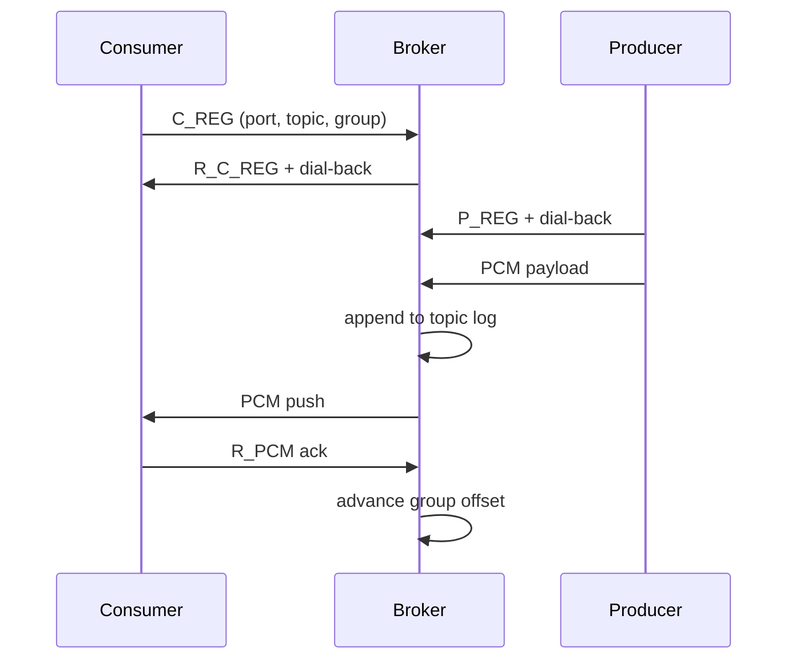

# Architecture — custom-dmq

## Components

```text
custom-dmq server          → broker (TCP :7777)
custom-dmq producer P T    → binds :P, registers topic T, accepts dial-back
custom-dmq consumer P T G  → binds :P, registers group G on topic T, receives push
```

## Wire protocol

Binary frames: `[length][type][payload]`

| Type | Value | Direction |
|------|-------|-----------|
| ECHO | 1 | client → broker |
| P_REG | 2 | producer → broker |
| C_REG | 3 | consumer → broker |
| PCM | 4 | producer → broker (dial-back) |
| R_* | 101–104 | responses |

## Push delivery flow



## Recent changes (vs prior text-protocol broker)

| Area | Before | Now |
|------|--------|-----|
| Wire format | Newline text (`REGISTER_PRODUCER`, `CONSUME`) | Binary `P_REG` / `C_REG` / `PCM` frames |
| Consumer flow | Pull via `CONSUME` on broker port | R_PCM ready handshake on dial-back connection |
| Delivery | Broker push loop to ready consumers | Consumer sends R_PCM, broker responds with PCM |
| Storage | Single topic queue | Staging queue + per-group partition queues |
| Topic key | String name | `u16` topic id |
| Groups | Flat `HashMap` on broker | `ConsumerGroup` with partition vectors per topic |
| Entry point | Single binary with embedded producer | `server` / `producer` / `consumer` CLI |

## Design notes

**Ready-initiated delivery.** Consumers send `R_PCM` when they want the next message. The broker pops from the consumer's assigned partition and replies with `PCM`.

**Staging and partitions.** Messages buffer in a topic staging queue until a consumer group registers. Each group owns one or more partitions; producers route new messages to the shortest partition per group.

**Dial-back registration.** Producers and consumers bind a local port, register with the broker, then accept an outbound connection from the broker for PCM traffic.

## Module map

| Module | Role |
|--------|------|
| `message.rs` | Binary encode/decode |
| `partition.rs` | Per-group partition queues |
| `topic.rs` | Staging queue + consumer groups |
| `cgroup.rs` | Group offset, consumer handles |
| `broker.rs` | Topic registry, produce, push delivery loop |
| `producer.rs` | Producer client |
| `consumer_client.rs` | Push consumer client |

## Running locally

```bash
cargo run -- server
cargo run -- consumer 7779 1 1
cargo run -- producer 7778 1 --simulate
```

## CI

GitHub Actions (`.github/workflows/ci.yml`): `fmt` → `clippy` → `cargo test` → release build.
