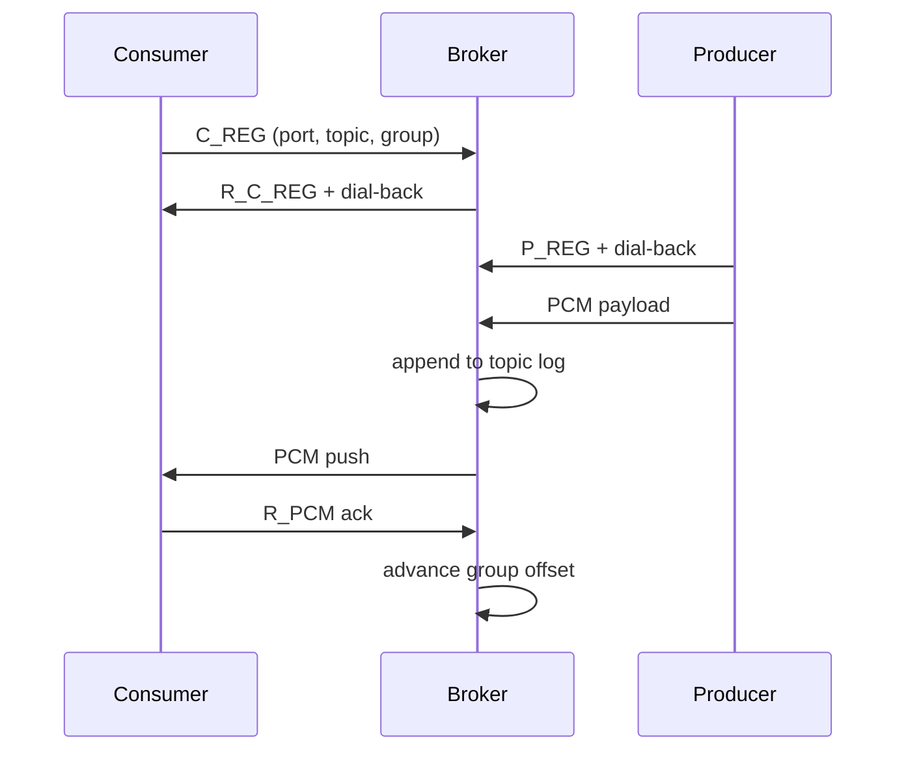

# Architecture — custom-dmq

## Components

```text
custom-dmq server          → broker (TCP :7777)
custom-dmq producer P T    → binds :P, registers topic T, accepts dial-back
custom-dmq consumer P T G  → binds :P, registers group G on topic T, receives push
```

## Wire protocol

Binary frames: `[length][type][payload]`

| Type | Value | Direction |
|------|-------|-----------|
| ECHO | 1 | client → broker |
| P_REG | 2 | producer → broker |
| C_REG | 3 | consumer → broker |
| PCM | 4 | producer → broker (dial-back) |
| R_* | 101–104 | responses |

## Push delivery flow



## Recent changes (vs prior text-protocol broker)

| Area | Before | Now |
|------|--------|-----|
| Wire format | Newline text (`REGISTER_PRODUCER`, `CONSUME`) | Binary `P_REG` / `C_REG` / `PCM` frames |
| Consumer flow | Pull via `CONSUME` on broker port | R_PCM ready handshake on dial-back connection |
| Delivery | Broker push loop to ready consumers | Consumer sends R_PCM, broker responds with PCM |
| Storage | Single topic queue | Staging queue + per-group partition queues |
| Topic key | String name | `u16` topic id |
| Groups | Flat `HashMap` on broker | `ConsumerGroup` with partition vectors per topic |
| Entry point | Single binary with embedded producer | `server` / `producer` / `consumer` CLI |

## Design notes

**Ready-initiated delivery.** Consumers send `R_PCM` when they want the next message. The broker pops from the consumer's assigned partition and replies with `PCM`.

**Staging and partitions.** Messages buffer in a topic staging queue until a consumer group registers. Each group owns one or more partitions; producers route new messages to the shortest partition per group.

**Dial-back registration.** Producers and consumers bind a local port, register with the broker, then accept an outbound connection from the broker for PCM traffic.

## Differentiation from Apache Kafka

`custom-dmq` borrows Kafka’s **vocabulary** (topics, consumer groups, partitions) but
implements a **local-first broker** for networking, storage layout, and delivery. The
differences are intentional: they keep the system small enough to run and maintain on
one machine while still teaching distributed-messaging concepts.

### Comparison

| Area | Apache Kafka | `custom-dmq` (current) | Reasoning |
|------|--------------|------------------------|-----------|
| **Client connectivity** | Producers and consumers connect **to** the broker cluster. | Clients bind a local port; the broker **dials back** after `P_REG` / `C_REG`. | Dial-back makes registration and long-lived PCM streams easy to implement with Tokio on a single host. No service discovery or ingress rules required for a local demo. |
| **Wire protocol** | Binary Kafka protocol (`Produce`, `Fetch`, `JoinGroup`, …). | Custom frames: `ECHO`, `P_REG`, `C_REG`, `PCM`, `R_*`. | Full Kafka protocol is large; a minimal typed frame set is enough to exercise encode/decode, registration, and message transport. |
| **Consumer API** | **Pull**: consumer issues `Fetch` with partition + offset; broker returns batches. | **Ready-initiated**: consumer sends `R_PCM`; broker pops one message and replies with `PCM`. | Pull requires offset management, fetch sessions, and backpressure policies. `R_PCM` is a minimal “I’m ready for the next message” handshake that maps cleanly to async read/write loops. |
| **Partition ownership** | Partitions belong to the **topic**. All consumer groups read the **same** partition logs. | Partitions belong to the **consumer group**. Each group has its own partition queues. | Parallelism is scoped per group, not shared across groups. Routing stays simple — produce fans out into every group’s shortest partition without coordinating a global partition assignment. |
| **Message fan-out** | One append to a partition; **each group** tracks its own offset into that shared log. | One produce **copies** the payload into each registered group’s partition queue. | Matches pub/sub semantics for independent groups on a small broker. Avoids offset vectors per group on a single shared log while groups are few and messages are small. |
| **Log semantics** | **Append-only commit log**: records stay until retention/compaction; consumers advance offsets. | **Destructive queues**: `pop_front` removes the message from the mmap-backed partition queue. | Queue pop is simpler to reason about for staging drain and per-partition delivery. Replay, compaction, and “reset offset” are out of scope for the current milestone. |
| **Offsets** | Durable, per `(group, topic, partition)`; committed to `__consumer_offsets`. | No durable consumer offset in the hot path; delivery position is implicit in each queue’s head/tail. | Offsets add coordinator logic and recovery rules. Head/tail in `partition_metadata_*.dat` is enough for persistence and restart without implementing a group coordinator. |
| **Staging** | N/A (topics exist independently of consumers). | Topic **staging queue** (reserved ids `65535/65535`) buffers until the first group registers. | Simple “produce before consume”: early messages are not dropped; they drain into partitions when a group appears. |
| **Scaling consumers** | More consumers in a group → rebalance **existing topic partitions** among members. | Second consumer in a group → **new partition** appended to that group. | Avoids rebalance protocol and partition assignment algorithms. Good for demonstrating “more consumers → more partition queues” without a group coordinator. |
| **Persistence** | Segment files per topic-partition, replication to followers, ISR. | mmap files (`underArr_*`, `underSize_*`, `partition_metadata_*`) + small metadata tables under `DMQ_DATA_DIR`. | Single-node durability for restart recovery. No replication, leader election, or cross-broker consensus — appropriate for a local/educational broker. |
| **Deployment** | Multi-broker cluster, ZooKeeper/KRaft metadata. | Single broker process (`cargo run -- server`). | One binary on one machine matches the project scope; cluster operations are a separate learning track. |

### What we kept from Kafka (and why)

- **Topics** — a named stream (`u16` topic id) gives producers and consumers a shared namespace without coupling to string topic names in the wire format.
- **Consumer groups** — multiple groups on one topic model independent subscribers (e.g. “billing” vs “analytics”) even though each group gets its own copy of the data here.
- **Partitions (concept)** — sharding work across parallel queues; in Kafka this scales consumption of one log, here it scales consumption **within** a group.
- **Bounded buffers** — `QUEUE_CAPACITY` and ring-style storage echo Kafka’s retention bound, though enforcement differs (mmap queues wrap by head/tail; the in-memory `Queue` in unit tests still implements offset-based eviction from an earlier step).

### What we deliberately did not copy from Kafka

- **Shared partition log per topic** — would require offset commits, fetch isolation, and rebalance; traded for per-group queues and fan-out produce.
- **Broker-as-server for data plane** — would match production Kafka but needs connection management from clients behind NAT; dial-back inverts that for local dev.
- **Replay and exactly-once** — would need idempotent producers, transactional writes, and non-destructive logs; current design targets at-most-once delivery with a simple pop.

### Practical implication

Treat `custom-dmq` as a **Kafka-shaped teaching broker**, not a Kafka-compatible one:
`rdkafka`, Kafka Connect, and standard CLI tools will not work without a protocol and
storage rewrite. The value is in practicing async I/O, framing, groups, partitions,
and mmap persistence on a tractable codebase.

To move toward production Kafka semantics later, the highest-leverage changes would be:
(1) topic-level partitions with a single append log, (2) pull-based fetch with committed
offsets, (3) clients connect to the broker, and (4) non-destructive segment storage with
explicit retention.

## Module map

| Module | Role |
|--------|------|
| `message.rs` | Binary encode/decode |
| `partition.rs` | Per-group partition queues |
| `topic.rs` | Staging queue + consumer groups |
| `cgroup.rs` | Consumer groups + partition assignment |
| `broker.rs` | Topic registry, produce, push delivery loop |
| `producer.rs` | Producer client |
| `consumer_client.rs` | Push consumer client |

## Running locally

```bash
cargo run -- server
cargo run -- consumer 7779 1 1
cargo run -- producer 7778 1 --simulate
```

## CI

GitHub Actions (`.github/workflows/ci.yml`): `fmt` → `clippy` → `cargo test` → release build.
